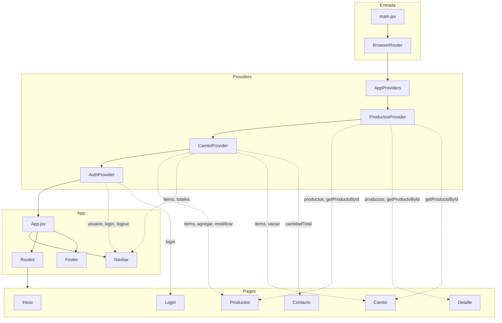
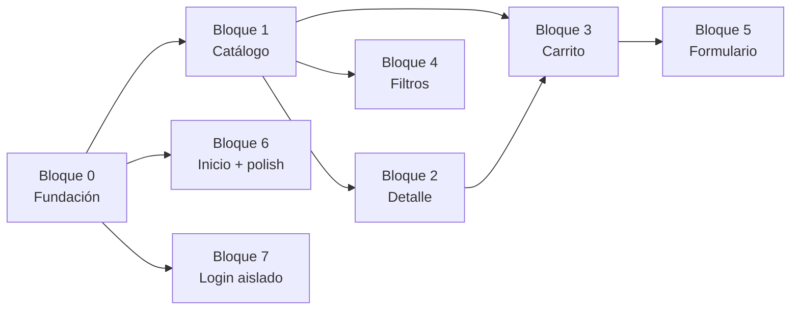

# Plan técnico - WizardGames

> **Versión:** 1.0  
> **Spec funcional:** `spec/requirements.md` v1.1  
> **Estado:** Aprobado para implementación

Este documento define **cómo** se construye WizardGames. No agrega requisitos nuevos; traduce la spec en arquitectura, responsabilidades y contratos de código.

---

## 1. Resumen arquitectónico

SPA en React + Vite con routing client-side. Los datos viven en arrays mock locales. El estado compartido se centraliza en tres Contexts. La UI usa React Bootstrap con estilos customizados mediante variables CSS de la paleta WizardGames.



---

## 2. Árbol de Providers

Los providers se anidan en `src/context/AppProviders.jsx` para mantener `main.jsx` limpio.

**Orden de anidación (de afuera hacia adentro):**

```
ProductosProvider
  └── CarritoProvider      ← depende de getProductoById para validar stock
        └── AuthProvider   ← independiente; va adentro por conveniencia
              └── App
```

**¿Por qué CarritoProvider dentro de ProductosProvider?**

`CarritoContext` necesita consultar `producto.stock` al agregar o incrementar cantidades. Anidarlo dentro de `ProductosProvider` permite usar `useProductos()` dentro de `CarritoProvider` sin acoplar componentes de UI.

**¿Por qué AuthProvider es independiente?**

F08 es una tarea aislada. `AuthContext` no interactúa con carrito ni productos. Puede implementarse en cualquier momento.

### 2.1 Integración en `main.jsx`

```jsx
// main.jsx - estructura objetivo
<StrictMode>
  <BrowserRouter>
    <AppProviders>
      <App />
    </AppProviders>
  </BrowserRouter>
</StrictMode>
```

---

## 3. Rutas

Definidas en `App.jsx` con React Router DOM v7.

| Ruta | Componente | Spec | Protegida |
|------|------------|------|-----------|
| `/` | `Inicio` | F01 | No |
| `/productos` | `Productos` | F02, F05 | No |
| `/producto/:id` | `DetalleProducto` | F03 | No |
| `/carrito` | `Carrito` | F04 | No |
| `/contacto` | `Contacto` | F06 | No |
| `/checkout` | `Checkout` | F09 | No |
| `/login` | `Login` | F08 | No |
| `*` | `NotFound` (opcional) | - | No |

> **Nota:** Ninguna ruta requiere autenticación. El login no bloquea el acceso a ninguna página (F08-07).

---

## 4. Contexts - contratos detallados

### 4.1 ProductosContext

**Archivo:** `src/context/ProductosContext.jsx`  
**Fuente de datos:** `src/data/productos.js`  
**Spec:** §3.1, F02, F03, F04, F05

#### Estado

| Campo | Tipo | Descripción |
|-------|------|-------------|
| `productos` | `Producto[]` | Array completo importado de `productos.js` (solo lectura) |

#### API expuesta

| Miembro | Tipo | Descripción |
|---------|------|-------------|
| `productos` | `Producto[]` | Lista completa del catálogo |
| `getProductoById(id)` | `(number) => Producto \| undefined` | Busca por `id`; usado en detalle, carrito y validaciones |
| `getCategorias()` | `() => string[]` | Devuelve categorías únicas deduplicadas de todos los productos (para filtro F05-B) |

#### Hook

```javascript
// Uso
const { productos, getProductoById, getCategorias } = useProductos();
```

#### Implementación sugerida

```javascript
// ProductosContext.jsx - pseudocódigo
const productos = PRODUCTOS; // import estático

const getProductoById = (id) =>
  productos.find((p) => p.id === Number(id));

const getCategorias = () =>
  [...new Set(productos.flatMap((p) => p.categorias))].sort();
```

#### Reglas

- El array **no se muta** en runtime (no hay CRUD de productos).
- `stock` en el producto es la única fuente de verdad para disponibilidad.
- No cachear copias de productos en otros contextos.

---

### 4.2 CarritoContext

**Archivo:** `src/context/CarritoContext.jsx`  
**Depende de:** `ProductosContext` (via `useProductos` interno)  
**Spec:** §3.2, F04, F02-05, F03-05, F06-07

#### Estado

| Campo | Tipo | Descripción |
|-------|------|-------------|
| `items` | `CarritoItem[]` | `{ productoId, cantidad }[]` |

#### API expuesta

| Miembro | Tipo | Descripción |
|---------|------|-------------|
| `items` | `CarritoItem[]` | Array de ítems del carrito |
| `agregarProducto(productoId)` | `(number) => void` | Agrega cantidad 1 o incrementa si ya existe; valida stock |
| `incrementarCantidad(productoId)` | `(number) => void` | +1 respetando `producto.stock` |
| `decrementarCantidad(productoId)` | `(number) => void` | −1; elimina ítem si cantidad llega a 0 |
| `eliminarProducto(productoId)` | `(number) => void` | Quita el ítem del array |
| `vaciarCarrito()` | `() => void` | Limpia todos los ítems (post-compra simulada) |
| `cantidadTotal` | `number` | Suma de todas las cantidades (derivado) |
| `totalPrecio` | `number` | Suma de subtotales (derivado) |
| `estaVacio` | `boolean` | `items.length === 0` (derivado) |
| `getSubtotal(productoId)` | `(number) => number` | `producto.precio × cantidad` |

#### Hook

```javascript
const {
  items,
  agregarProducto,
  incrementarCantidad,
  decrementarCantidad,
  eliminarProducto,
  vaciarCarrito,
  cantidadTotal,
  totalPrecio,
  estaVacio,
} = useCarrito();
```

#### Lógica de `agregarProducto`

```javascript
function agregarProducto(productoId) {
  const producto = getProductoById(productoId);
  if (!producto || producto.stock === 0) return;

  setItems((prev) => {
    const existente = prev.find((i) => i.productoId === productoId);
    if (existente) {
      if (existente.cantidad >= producto.stock) return prev;
      return prev.map((i) =>
        i.productoId === productoId
          ? { ...i, cantidad: i.cantidad + 1 }
          : i
      );
    }
    return [...prev, { productoId, cantidad: 1 }];
  });
}
```

#### Valores derivados

Calcular `cantidadTotal` y `totalPrecio` con `useMemo` para evitar recalcular en cada render:

```javascript
const cantidadTotal = useMemo(
  () => items.reduce((acc, i) => acc + i.cantidad, 0),
  [items]
);

const totalPrecio = useMemo(
  () =>
    items.reduce((acc, i) => {
      const p = getProductoById(i.productoId);
      return p ? acc + p.precio * i.cantidad : acc;
    }, 0),
  [items, productos]
);
```

#### Reglas

- Nunca almacenar `nombre`, `precio` ni `stock` en el ítem del carrito.
- Si `getProductoById` devuelve `undefined` para un `productoId` en el carrito (CB-11), omitir ese ítem al renderizar o limpiarlo con un efecto defensivo.
- `vaciarCarrito()` se llama tras envío exitoso del checkout (F09-11).

---

### 4.3 AuthContext

**Archivo:** `src/context/AuthContext.jsx`  
**Fuente de datos:** `src/data/credenciales.js`  
**Spec:** F08 (tarea aislada)

#### Estado

| Campo | Tipo | Descripción |
|-------|------|-------------|
| `usuario` | `string \| null` | Nombre de usuario logueado; `null` si no hay sesión |

#### API expuesta

| Miembro | Tipo | Descripción |
|---------|------|-------------|
| `usuario` | `string \| null` | Usuario activo |
| `isAuthenticated` | `boolean` | `usuario !== null` |
| `login(usuario, password)` | `(string, string) => boolean` | Valida credenciales; actualiza estado si OK |
| `logout()` | `() => void` | Limpia sesión |

#### Hook

```javascript
const { usuario, isAuthenticated, login, logout } = useAuth();
```

#### Persistencia opcional

Restaurar sesión desde `sessionStorage` al montar (F08-05):

```javascript
// useEffect al iniciar
const saved = sessionStorage.getItem('wizardgames_user');
if (saved) setUsuario(saved);

// Tras login exitoso
sessionStorage.setItem('wizardgames_user', usuario);

// Tras logout
sessionStorage.removeItem('wizardgames_user');
```

#### Reglas

- Credenciales en `data/credenciales.js`; no hardcodear en el componente Login.
- Login fallido: retornar `false`, no actualizar estado (CB-12).
- **No** usar auth para proteger rutas ni bloquear carrito/catálogo.

---

## 5. Datos mock

### 5.1 `src/data/productos.js`

Exporta un array `PRODUCTOS` con **mínimo 12** videojuegos.

**Categorías sugeridas:** `"Juegos"`, `"Consolas"`, `"Accesorios"`, `"Merchandising"`, `"Digital"`.

**Plataformas sugeridas:** `"PC"`, `"PS5"`, `"Xbox Series X"`, `"Nintendo Switch"`, `"Multiplataforma"`.

**Géneros sugeridos:** `"Acción"`, `"RPG"`, `"Aventura"`, `"Deportes"`, `"Indie"`, `"Estrategia"`.

**Distribución recomendada:**

- Al menos **2 productos** con `stock: 0` (para F02-06, CB-01).
- Al menos **2 productos** con múltiples categorías/plataformas (para CB-13).
- Precios entre `$5.000` y `$120.000` (para F05-C).

```javascript
// Ejemplo de un producto
{
  id: 1,
  nombre: "Elden Ring",
  categorias: ["Juegos", "Digital"],
  plataformas: ["PC", "PS5", "Xbox Series X"],
  generos: ["Acción", "RPG"],
  precio: 45999,
  imagen: "/img/elden-ring.jpg",
  descripcion: "RPG de mundo abierto desarrollado por FromSoftware.",
  stock: 15,
  anio: 2022
}
```

### 5.2 `src/data/credenciales.js`

```javascript
export const CREDENCIALES = {
  usuario: "wizard",
  password: "games123",
};
```

---

## 6. Componentes

### 6.1 Mapa de responsabilidades

| Componente | Props / Context | Responsabilidad |
|------------|-----------------|-----------------|
| `Navbar` | `useCarrito`, `useAuth` | Links F07; badge cantidad carrito; login/logout |
| `Footer` | - | Info WizardGames, links secundarios |
| `ProductoCard` | `producto` (prop), `useCarrito` | Card F02; botones detalle y agregar |
| `CarritoItem` | `item` (prop), `useProductos`, `useCarrito` | Fila de carrito F04; +/-, eliminar, subtotal |
| `FormularioContacto` | — | Consultas generales F06 |
| `FormularioCompra` | `useCarrito` | Checkout F09 |
| `FiltrosProductos` | `filtros`, `onChange` (props) | Controles F05-A a F05-E; estado local en page |
| `Layout` *(opcional)* | `children` | Wrapper Navbar + main + Footer |

### 6.2 Props vs Context - criterio de uso

| Situación | Mecanismo | Ejemplo |
|-----------|-----------|---------|
| Padre renderiza hijo directo con un dato | **Props** | `Productos` → `ProductoCard producto={p}` |
| Estado de filtros solo usado en una page | **useState local** | `Productos` maneja filtros, pasa a `FiltrosProductos` |
| Carrito accesible desde Navbar, Card, Detalle | **Context** | `useCarrito()` |
| Catálogo consultado en Detalle y Carrito | **Context** | `useProductos()` |
| Sesión visible en Navbar y Login | **Context** | `useAuth()` |

### 6.3 ProductoCard

```
Props: { producto: Producto }
Context: useCarrito → agregarProducto

Renderiza:
  - imagen, nombre, categorias[0] o join, precio formateado
  - descripcion (truncada opcional)
  - stock / badge "Sin stock"
  - Link a /producto/:id
  - Button agregar (disabled si stock === 0)
```

### 6.4 CarritoItem

```
Props: { item: CarritoItem }
Context: useProductos → getProductoById
         useCarrito → incrementar, decrementar, eliminar

Renderiza:
  - nombre, precio unitario (desde producto)
  - cantidad con botones +/−
  - subtotal = producto.precio × item.cantidad
  - botón eliminar
  - botón + disabled si cantidad >= producto.stock
```

---

## 7. Páginas

### 7.1 Inicio (`/`)

- Hero con **WizardGames** (Space Grotesk).
- Banner o slider.
- Descripción del emprendimiento.
- CTA → `/productos`.
- **Estado:** ninguno (presentacional).

### 7.2 Productos (`/productos`)

- **Estado local (`useState`):** filtros F05.

```javascript
const [filtros, setFiltros] = useState({
  busqueda: "",
  categoria: "",        // "" = todas
  precioMin: "",
  precioMax: "",
  orden: "",            // "" | "asc" | "desc"
});
```

- **Context:** `useProductos()` → productos; `useCarrito()` → agregar (via ProductoCard).
- **Pipeline de filtrado** (función pura o `useMemo`):

```javascript
function filtrarProductos(productos, filtros) {
  let resultado = [...productos];

  // F05-A: búsqueda
  if (filtros.busqueda) {
    const q = filtros.busqueda.toLowerCase();
    resultado = resultado.filter((p) =>
      p.nombre.toLowerCase().includes(q)
    );
  }

  // F05-B: categoría
  if (filtros.categoria) {
    resultado = resultado.filter((p) =>
      p.categorias.includes(filtros.categoria)
    );
  }

  // F05-C: rango de precio
  if (filtros.precioMin !== "") {
    resultado = resultado.filter((p) => p.precio >= Number(filtros.precioMin));
  }
  if (filtros.precioMax !== "") {
    resultado = resultado.filter((p) => p.precio <= Number(filtros.precioMax));
  }

  // F05-D / F05-E: orden (mutuamente excluyente)
  if (filtros.orden === "asc") {
    resultado.sort((a, b) => a.precio - b.precio);
  } else if (filtros.orden === "desc") {
    resultado.sort((a, b) => b.precio - a.precio);
  }

  return resultado;
}
```

- Grid de `ProductoCard` con `.map()`.
- Mensaje si `resultado.length === 0`.

### 7.3 DetalleProducto (`/producto/:id`)

- `useParams()` → `id`.
- `useProductos()` → `getProductoById(id)`.
- `useCarrito()` → `agregarProducto`.
- Si no existe: mensaje + Link a `/productos`.
- Badges para `categorias`, `plataformas`, `generos`.

### 7.4 Carrito (`/carrito`)

- `useCarrito()` → items, totales, acciones.
- `useProductos()` → resolver datos por productoId en cada `CarritoItem`.
- Si `estaVacio`: mensaje + link catálogo.
- CTA único **Finalizar compra** → navega a `/checkout` (F04-09). Sin modal ni confirmación en esta página.

### 7.5 Contacto (`/contacto`)

- Renderiza `FormularioContacto`.
- Sin vínculo al carrito (F06-10).

### 7.6 Checkout (`/checkout`)

- Renderiza `FormularioCompra` + resumen del pedido.
- `FormularioCompra` usa `useCarrito()` para validar `estaVacio` (F09-07) y `vaciarCarrito()` al enviar (F09-11).
- Acceso principal desde `/carrito` (F04-09).

### 7.7 Login (`/login`) - F08 aislado

- Formulario controlado: usuario + password.
- `useAuth()` → `login()`.
- Éxito → `navigate("/")` o `/productos`.
- Error → mensaje genérico.

---

## 8. FormularioCompra - diseño

**Estado local:**

```javascript
const [form, setForm] = useState({
  nombre: "",
  apellido: "",
  email: "",
  telefono: "",
  mensaje: "",
});

const [errores, setErrores] = useState({});
const [enviado, setEnviado] = useState(false);
```

**Validación (función pura):**

```javascript
function validarFormulario(form) {
  const errores = {};
  if (!form.nombre.trim()) errores.nombre = "El nombre es obligatorio";
  if (!form.apellido.trim()) errores.apellido = "El apellido es obligatorio";
  if (!form.email.trim()) {
    errores.email = "El email es obligatorio";
  } else if (!/^[^\s@]+@[^\s@]+\.[^\s@]+$/.test(form.email)) {
    errores.email = "Email inválido";
  }
  // teléfono: sin validación (F06-06)
  return errores;
}
```

**Submit:**

1. Si `estaVacio` → error global, no continuar.
2. Validar campos → si hay errores, mostrar y abortar.
3. Simular envío → `setEnviado(true)`.

---

## 9. Estilos e identidad visual

### 9.1 Archivos CSS

| Archivo | Rol |
|---------|-----|
| `src/index.css` | Variables CSS globales, fuentes, reset básico |
| `src/App.css` | Estilos de layout, overrides de Bootstrap |
| Bootswatch Vapor | Base de componentes Bootstrap (import en `main.jsx`) |

### 9.2 Variables CSS (`index.css`)

```css
:root {
  --color-bg: #0F172A;
  --color-surface: #1E293B;
  --color-brand: #3B82F6;
  --color-accent: #22D3EE;
  --color-cta: #F97316;
  --color-text: #F8FAFC;

  --font-body: 'Inter', system-ui, sans-serif;
  --font-heading: 'Space Grotesk', system-ui, sans-serif;
}

body {
  font-family: var(--font-body);
  background-color: var(--color-bg);
  color: var(--color-text);
}

h1, h2, h3, h4, h5, h6, .brand {
  font-family: var(--font-heading);
}
```

### 9.3 Fuentes

Importar en `index.html` o `index.css`:

```html
<link rel="preconnect" href="https://fonts.googleapis.com">
<link href="https://fonts.googleapis.com/css2?family=Inter:wght@400;500;600&family=Space+Grotesk:wght@500;700&display=swap" rel="stylesheet">
```

### 9.4 Overrides Bootstrap

Sobreescribir variables Bootstrap donde aplique:

```css
.card {
  background-color: var(--color-surface);
  border-color: var(--color-brand);
}

.btn-primary {
  background-color: var(--color-cta);
  border-color: var(--color-cta);
}

.navbar {
  background-color: var(--color-surface) !important;
}
```

---

## 10. Utilidades (opcional)

**Archivo sugerido:** `src/utils/formatters.js`

```javascript
export function formatPrecio(precio) {
  return new Intl.NumberFormat("es-AR", {
    style: "currency",
    currency: "ARS",
    maximumFractionDigits: 0,
  }).format(precio);
}
```

Usar en `ProductoCard`, `CarritoItem`, `Carrito`, `DetalleProducto`.

---

## 11. Matriz de estado

| Estado | Ubicación | Motivo |
|--------|-----------|--------|
| Array de productos | `ProductosContext` | Compartido entre catálogo, detalle, carrito |
| Items del carrito | `CarritoContext` | Compartido entre Navbar, cards, detalle, carrito, form |
| Sesión de login | `AuthContext` | Compartido entre Navbar y Login |
| Filtros F05 | `useState` en `Productos` | Solo afecta esa página |
| Formulario contacto F06 | `useState` en `FormularioContacto` | Local; no afecta carrito |
| Formulario checkout F09 | `useState` en `FormularioCompra` | Local; vacía carrito al confirmar |
| UI navbar colapsado | Bootstrap interno | No requiere estado propio |

---

## 12. Orden de implementación

Dependencias entre bloques:



| Orden | Bloque | Archivos principales | Depende de |
|-------|--------|---------------------|------------|
| 1 | 0 - Fundación | `App.jsx`, `Navbar`, `Footer`, `index.css`, rutas | - |
| 2 | 1 - Catálogo | `productos.js`, `ProductosContext`, `ProductoCard`, `Productos` | Bloque 0 |
| 3 | 2 - Detalle | `DetalleProducto` | Bloque 1 |
| 4 | 3 - Carrito | `CarritoContext`, `CarritoItem`, `Carrito` | Bloques 1, 2 |
| 5 | 4 - Filtros | `FiltrosProductos`, pipeline en `Productos` | Bloque 1 |
| 6 | 5 - Formulario | `FormularioCompra`, `Contacto` | Bloque 3 |
| 7 | 6 - Inicio + polish | `Inicio`, README, responsive | Bloque 0+ |
| 8 | 7 - Login *(paralelo)* | `credenciales.js`, `AuthContext`, `Login` | Bloque 0 |

---

## 13. Checklist de archivos a crear

### Bloque 0
- [ ] `src/context/AppProviders.jsx`
- [ ] `src/components/Navbar.jsx`
- [ ] `src/components/Footer.jsx`
- [ ] `src/pages/Inicio.jsx` *(placeholder)*
- [ ] `src/pages/Productos.jsx` *(placeholder)*
- [ ] `src/pages/DetalleProducto.jsx` *(placeholder)*
- [ ] `src/pages/Carrito.jsx` *(placeholder)*
- [ ] `src/pages/Contacto.jsx` *(placeholder)*
- [ ] `src/pages/Login.jsx` *(placeholder)*
- [ ] Actualizar `App.jsx` con Routes
- [ ] Variables CSS + fuentes en `index.css`

### Bloque 1
- [ ] `src/data/productos.js`
- [ ] `src/context/ProductosContext.jsx`
- [ ] `src/components/ProductoCard.jsx`
- [ ] Completar `src/pages/Productos.jsx`

### Bloque 2
- [ ] Completar `src/pages/DetalleProducto.jsx`

### Bloque 3
- [ ] `src/context/CarritoContext.jsx`
- [ ] `src/components/CarritoItem.jsx`
- [ ] Completar `src/pages/Carrito.jsx`
- [ ] Conectar badge en `Navbar`

### Bloque 4
- [ ] `src/components/FiltrosProductos.jsx`
- [ ] Pipeline de filtrado en `Productos.jsx`

### Bloque 5
- [ ] `src/components/FormularioCompra.jsx`
- [ ] Completar `src/pages/Contacto.jsx`

### Bloque 6
- [ ] Completar `src/pages/Inicio.jsx`
- [ ] `src/utils/formatters.js`
- [ ] README.md

### Bloque 7 (aislado)
- [ ] `src/data/credenciales.js`
- [ ] `src/context/AuthContext.jsx`
- [ ] Completar `src/pages/Login.jsx`
- [ ] Login/logout en `Navbar`

---

## 14. Convenciones de código

| Tema | Convención |
|------|------------|
| Componentes | PascalCase, un componente por archivo |
| Contexts | `NombreContext.jsx` + hook `useNombre()` |
| Datos mock | UPPER_SNAKE para exports constantes (`PRODUCTOS`, `CREDENCIALES`) |
| IDs de spec | Referenciar en commits: `(F04-03)` |
| Imports | Rutas relativas (`../context/CarritoContext`) |
| Bootstrap | Preferir componentes de `react-bootstrap` sobre HTML + clases sueltas |

---

## 15. Historial de cambios

| Versión | Fecha | Cambio |
|---------|-------|--------|
| 1.0 | 2026-06-04 | Plan inicial: arquitectura, 3 Contexts, rutas, componentes, pipeline filtros |
